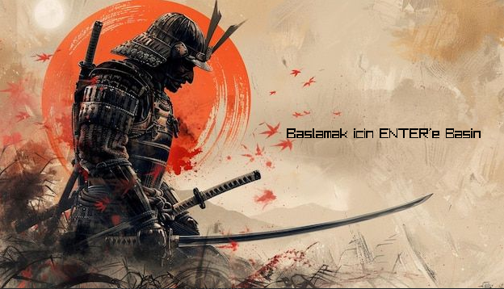
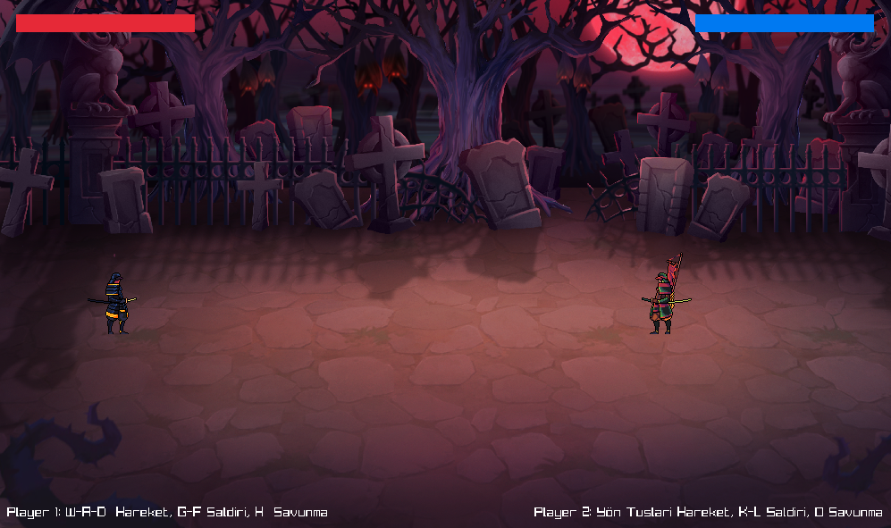
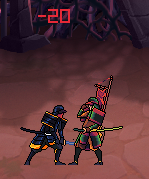
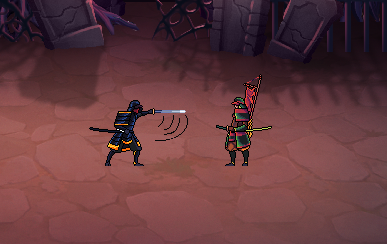
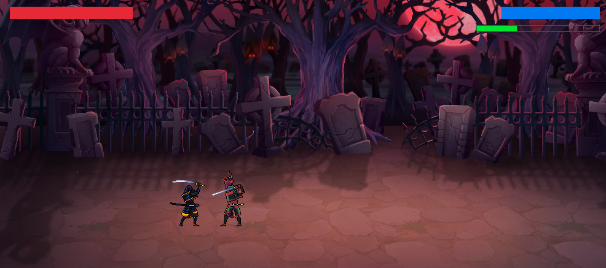
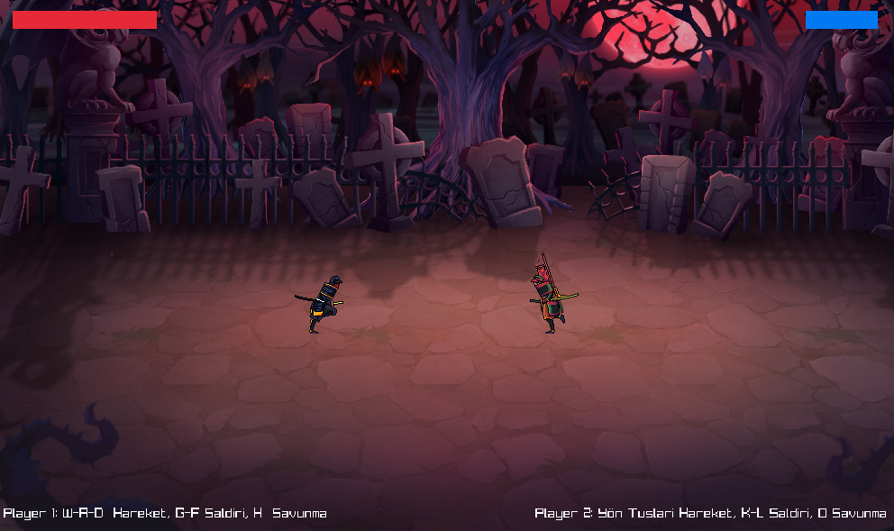
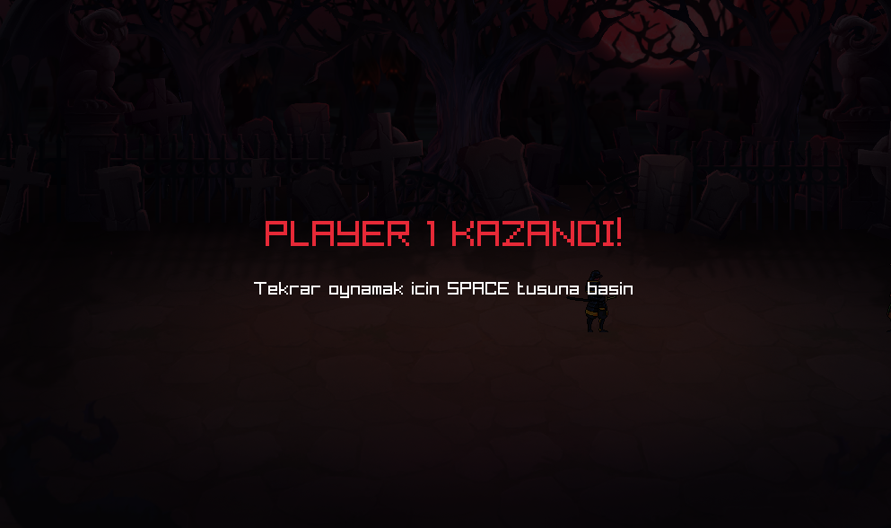

# 🥷 2 Player Samurai Battle         (SERGEN ALTINÖZ 24253601)

## 🎮 Oyun Hakkında
👉 Alternatif olarak: [Oyunun Oynanışını Gösteren Videoyu Buradan İzleyebilirsin! 🎥](https://youtu.be/5-tC_zgC3Do)
##
👉 Alternatif olarak: [Oyunun Kaynak Kodlarını Tanıtan Videoyu Buradan İzleyebilirsin! 🎥](https://youtu.be/2GPv98qP738)
## 🛠️ Geliştirme Ortamı

Bu proje C++ ile geliştirildi ve grafik/müzik altyapısı için raylib kullanıldı. Kod yazımı ve derleme süreçleri CLion IDE üzerinde yürütülmüştür.

##

**2 Player Samurai Battle**, 2 boyutlu bir dövüş oyunudur ve aynı klavye üzerinden iki kişi birlikte oynanabilir.  
Oyunda heyecanı artırmak için enerjik bir arka plan müziği, profesyonel ses efektleri ve şık bir ana menü bulunmaktadır.  
Dövüş başladığında "Hadi Başlayalım!" şeklinde bir ses efekti ile oyunculara atmosfer sağlanır.

Her iki karakter de eşit şartlarda mücadele eder.  
Oyuncular, özel ses efektleriyle desteklenen saldırılar yapabilir veya savunma mekanizmasını kullanarak rakip saldırılarından korunabilirler.  
Her vuruşun farklı bir ses efekti olması, oyuna ayrı bir dinamizm ve eğlence katar.

Oyuncuların sağlık durumları ekranın üst kısmında gösterilir:
- **1. Oyuncu (Player 1):** Kırmızı sağlık çubuğu ile belirtilmiştir.
- **2. Oyuncu (Player 2):** Mavi sağlık çubuğu ile belirtilmiştir.

---

## 🕹️ Oyun Kontrolleri

### 1. Oyuncu (Soldaki Oyuncu)
- **W:** Zıplama
- **A - D:** Hareket (Sol - Sağ)
- **F:** Hızlı vuruş (10 can götürür, bekleme süresi kısa)
- **G:** Güçlü vuruş (20 can götürür, bekleme süresi uzun)
- **H:** Savunma (Bekleme süresi yukarıdaki yeşil çubukla gösterilir)

### 2. Oyuncu (Sağdaki Oyuncu)
- **Yön Tuşları:** Hareket ve zıplama
- **K:** Hızlı vuruş (10 can götürür, bekleme süresi kısa)
- **L:** Güçlü vuruş (20 can götürür, bekleme süresi uzun)
- **O:** Savunma (Bekleme süresi yukarıdaki yeşil çubukla gösterilir)

---

## ✨ Özellikler

- 🧑‍🤝‍🧑 İki kişilik yerel oyun (aynı klavyede oynanır)
- 🎵 Her oyuncuya özel ses efektleri
- 🎶 Her vuruşta farklı ses efektleri
- 🛡️ Savunma mekaniği
- 🎨 2D grafikler ve akıcı dövüş deneyimi
- 🏮 Samuray temalı savaş atmosferi
- 🎼 Coşkulu arka plan müziği
- 🎬 Ana menü ve oyun başlatma ses efektleri

---

## 📷 Bu savaşta kazanan sen ol! 🥷🔥

---
